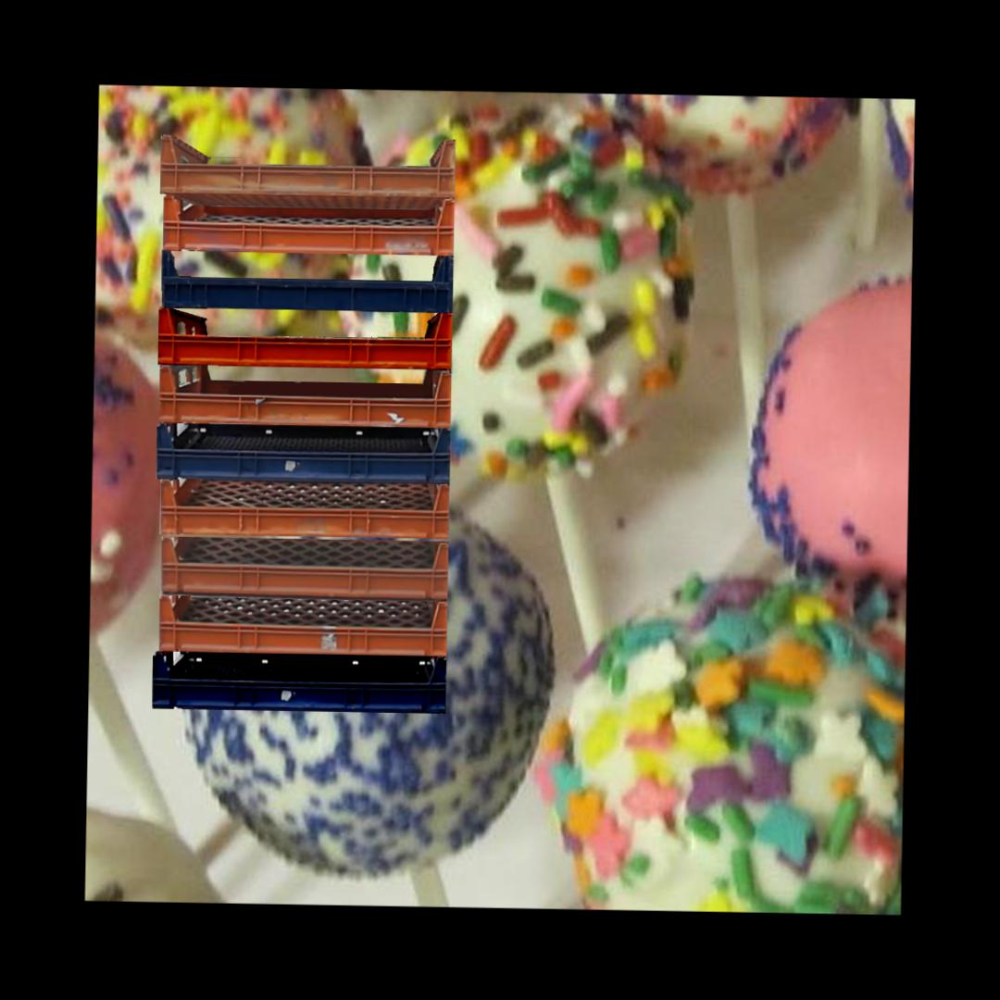
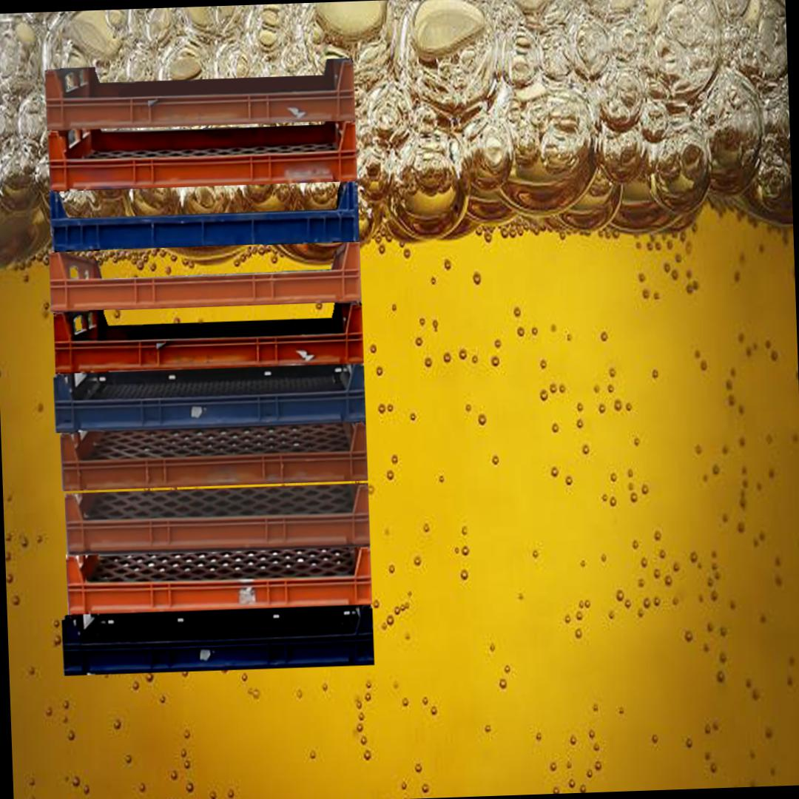
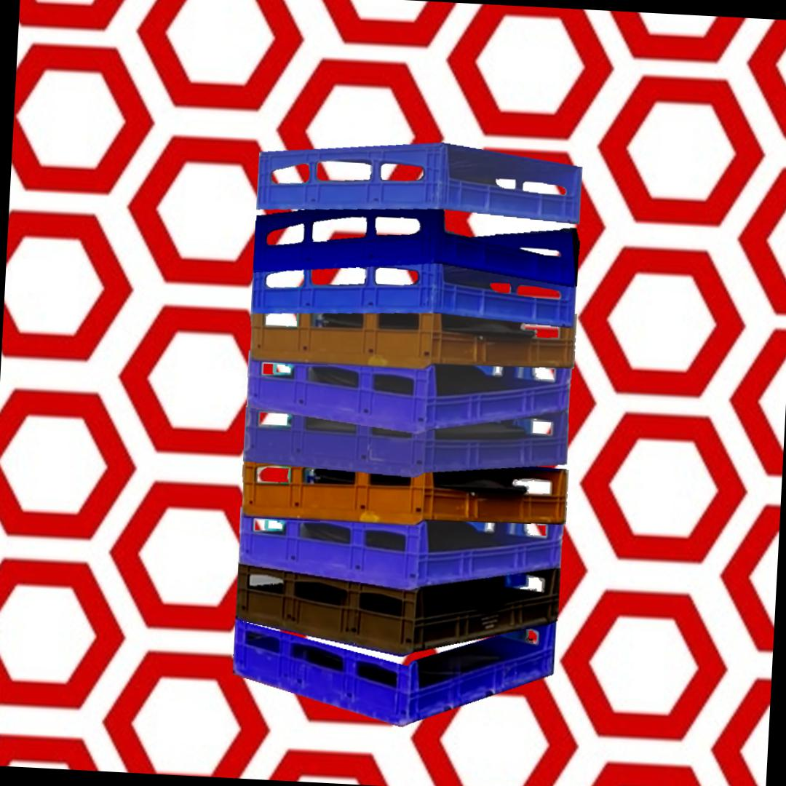

# Crates dataset generator
Generating a dataset of crates to train a neural net.

This dataset can be used for the training of a neural net intended to detect/localize playing cards. It was used on the project of Plastic Crates Counter for android

# Convert dataset for YOLO training
YOLO cannot directly exploit the Pascal VOC annotations files. You need to convert the xml files in txt files accordingly to the syntax explained here: https://github.com/AlexeyAB/darknet#how-to-train-to-detect-your-custom-objects The script 'convert_voc_yolo.py' makes this conversion and also generates the txt file that contains all the images of the dataset

python convert_voc_yolo.py data/scenes/train data/classes.names data/train.txt

